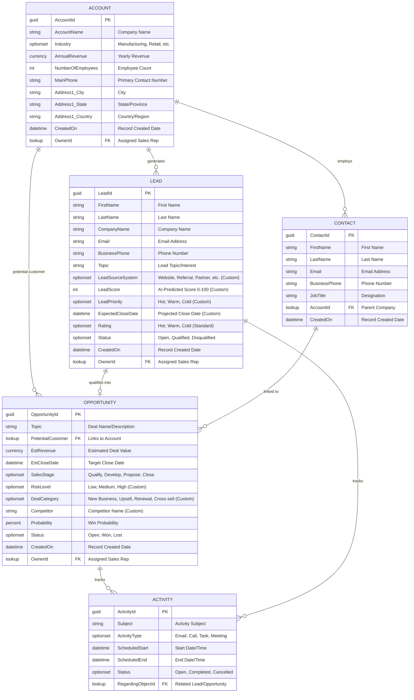
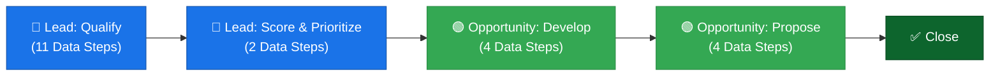
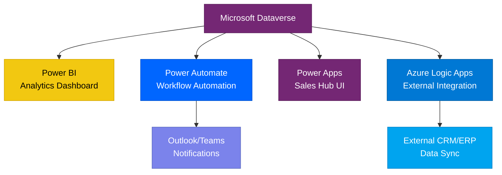

# SmartOps 360 — Data Model & Entity Relationship Diagram

> **Project:** SmartOps 360 — Intelligent Sales Operations Platform  
> **Client:** Vantage Solutions Pvt. Ltd.  
> **Prepared by:** Adi Sharma | PwC Consulting  
> **Platform:** Microsoft Dynamics 365 Sales + Power Platform  
> **Last Updated:** March 2026

---

## 1. Data Architecture Overview

SmartOps 360 leverages Microsoft Dataverse as the unified data layer, extending standard Dynamics 365 Sales entities with custom columns to support AI-driven lead scoring, intelligent pipeline management, and predictive analytics.

### Design Principles
- **Extend, Don't Replace** — Custom columns are added to standard D365 entities to preserve out-of-the-box functionality
- **Referential Integrity** — All relationships use Dataverse-managed lookups with cascading rules
- **Analytics-Ready** — Schema designed for seamless Power BI integration via Dataverse connector

---

## 2. Entity Relationship Diagram

---

## 3. Custom Columns Summary

### 3.1 Lead Table — Custom Extensions

| Column Name | Display Name | Data Type | Description | Business Purpose |
|-------------|-------------|-----------|-------------|-----------------|
| `cr_leadscore` | Lead Score | Whole Number (0–100) | AI-predicted conversion probability | Prioritize sales outreach based on ML scoring |
| `cr_leadpriority` | Lead Priority | Choice (Hot/Warm/Cold) | Priority classification based on score thresholds | Quick visual categorization for SDRs |
| `cr_leadsourcesystem` | Lead Source System | Choice (6 options) | Channel that generated the lead | Track marketing ROI by acquisition channel |
| `cr_expectedclosedate` | Expected Close Date | Date Only | Projected deal closure timeline | Revenue forecasting and pipeline planning |

### 3.2 Opportunity Table — Custom Extensions

| Column Name | Display Name | Data Type | Description | Business Purpose |
|-------------|-------------|-----------|-------------|-----------------|
| `cr_risklevel` | Risk Level | Choice (Low/Medium/High) | Deal risk assessment indicator | Proactive risk mitigation in pipeline |
| `cr_dealcategory` | Deal Category | Choice (4 options) | Revenue classification type | Distinguish new vs. expansion revenue |
| `cr_competitor` | Competitor | Text (Single Line) | Primary competitor in the deal | Competitive intelligence tracking |

---

## 4. Relationships & Cardinality

| Parent Entity | Relationship | Child Entity | Type | Cascade |
|--------------|-------------|-------------|------|---------|
| Account | 1 : N | Lead | Lookup | Referential |
| Account | 1 : N | Opportunity | Lookup (Potential Customer) | Referential |
| Account | 1 : N | Contact | Lookup (Parent Account) | Parental |
| Lead | 1 : 0..1 | Opportunity | System-managed (Qualification) | Referential |
| Contact | 1 : N | Opportunity | Lookup | Referential |
| Lead / Opportunity | 1 : N | Activity | Polymorphic (Regarding) | Referential |

---

## 5. Business Process Flow — Stage Mapping

### Stage Details

| Stage | Entity | Key Data Steps | Purpose |
|-------|--------|---------------|---------|
| **Qualify** | Lead | Contact info, Company, Budget, Timeline, Rating | Initial lead qualification |
| **Score & Prioritize** | Lead | Lead Score, Lead Priority | AI-driven scoring and prioritization |
| **Develop** | Opportunity | Customer Need, Proposed Solution, Stakeholders | Solution development and alignment |
| **Propose** | Opportunity | Proposal, Revenue, Close Date, Risk Assessment | Commercial proposal and negotiation |
| **Close** | Opportunity | Final Decision, Win/Loss Reason | Deal closure and outcome tracking |

---

## 6. Data Volume & Sample Records

| Entity | Sample Records | Production Estimate (Year 1) |
|--------|---------------|------------------------------|
| Account | 25 | 200–500 |
| Lead | 60 | 2,000–5,000 |
| Opportunity | 35 | 500–1,500 |
| Contact | 16 (pre-loaded) | 1,000–3,000 |
| Activity | — (auto-generated) | 10,000–25,000 |

---

## 7. Option Set Definitions

### Lead Source System
| Value | Label | Description |
|-------|-------|-------------|
| 1 | Website | Inbound web form or chat |
| 2 | Referral | Existing customer or partner referral |
| 3 | Cold Call | Outbound sales development |
| 4 | Partner | Channel partner sourced |
| 5 | Trade Show | Event or conference lead |
| 6 | Social Media | LinkedIn, Twitter, or other social |

### Lead Priority
| Value | Label | Score Range |
|-------|-------|-------------|
| 1 | Hot | 80–100 |
| 2 | Warm | 50–79 |
| 3 | Cold | 0–49 |

### Risk Level (Opportunity)
| Value | Label | Criteria |
|-------|-------|----------|
| 1 | Low | Strong champion, clear budget, short cycle |
| 2 | Medium | Some uncertainty in timeline or budget |
| 3 | High | No champion, budget unconfirmed, competitive |

### Deal Category (Opportunity)
| Value | Label | Description |
|-------|-------|-------------|
| 1 | New Business | First-time customer acquisition |
| 2 | Upsell | Expanding existing contract value |
| 3 | Renewal | Contract renewal with existing customer |
| 4 | Cross-sell | Selling additional product/service lines |

---

## 8. Integration Touchpoints

---

> **Note:** This data model document is a living artifact. Column schema prefixes (e.g., `cr_`) will vary based on the solution publisher prefix configured in the SmartOps360 environment.
